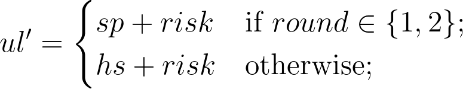
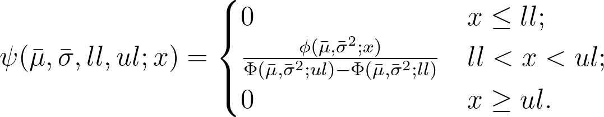

[](https://doi.org/10.5281/zenodo.14840266)

# Simulation Model

Simulation data is available in the DOI link below.

[](https://doi.org/10.5281/zenodo.14840331)

## The Model

This repository implements a stochastic game-theoretic model of human behaviour in an incomplete information game (poker). The behaviour modeled is non-deterministic, yet not uniformly random; it tends to conform to specific trends over a long term. A truncated normal distribution is utilised to simulate this behaviour.

### Variables Involved

1. **$\bar{\mu}$**: A measure of how an entity perceives its current condition. It is calculated as:  
   $$\bar{\mu} = hs + shift$$  
   where:  
   - $hs$: Hand strength.  
   - $shift$: The self-proclaimed level of confidence the entity has on their current position.  

2. **$ps$**: The portion of the pot an entity is expected to win based on its equity in the current hand. It is calculated as:  
   $$ps = \frac{\text{callValue}}{\text{pot}}$$  

3. **$ll$**: The lower limit of the truncated normal distribution, fixed at $0$.

4. **$ul'$**: The upper limit of an entity's playing range, determined as:

  <p align="center">
    
  </p>

   where:

- $sp$: Future potential.  
- $risk$: The entity's risk appetite.
- $round$: Poker game round (0 for pre-flop, 1 for flop, and so on).

5. **$ul$**: The actual upper limit of the truncated normal distribution, defined as:  
   $$ul = \max(\bar{\mu}, ul')$$  

### Truncated Normal Distribution

The truncated normal distribution is defined as:  
<p align="center">
  
</p>

where:  

- $\bar{\mu}$: Mean of the underlying normal distribution before truncation.  
- $\bar{\sigma}$: Standard deviation of the underlying normal distribution before truncation, calculated as $(ul - ll) / 3$.
- $ll$: Lower bound for truncation (fixed at $0$).
- $ul$: Upper bound for truncation.  
- $x$: The random variable being evaluated.  
- $\phi(\bar{\mu}, \bar{\sigma}^2; x)$: Probability density function (PDF) of the normal distribution.  
- $\Phi(\bar{\mu}, \bar{\sigma}^2; a)$: Cumulative distribution function (CDF) of the normal distribution at $a$.

The PDF of the normal distribution is:  
$$\phi(x) = \frac{1}{\sqrt{2 \pi \bar{\sigma}^2}} e^{-\frac{(x - \bar{\mu})^2}{2 \bar{\sigma}^2}}$$  

The CDF is:  
$$\Phi(x) = \int_{-\infty}^x \phi(t) \, dt$$  

### Workflow Summary

After calculating the parameters of an entity's decision-making process, a decision factor is sampled using the truncated normal distribution which is then used, along with `ps` to make a decision.

---

## Repository Components

| Folder         | Description                                                                 |
|----------------|-----------------------------------------------------------------------------|
| `analysis`     | Scripts for analyzing the output of the simulation engine.                 |
| `checks`       | Tests for various components of the engine.                                |
| `components`   | Core components of the simulation engine.                                  |
| `configs`      | Configuration files and generators for different game profiles.            |
| `data`         | Stores the output data generated by the simulation engine.                 |
| `engines`      | Variations of the simulation engines.                                      |
| `hand_evaluator` | Poker hand evaluation using [PokerHandEvaluator](https://github.com/HenryRLee/PokerHandEvaluator). |
| `poker_metrics` | Metrics to evaluate an entity's position in the poker game.               |
| `strategies`   | Player or strategy profiles.                                               |

Below is the corrected Markdown text:

---

## Running a Simulation

### Setting Up

First, set up the strategies in `config.csv` (or create a new strategy configuration file) located in the `configs` directory. To create a new strategy, add an entry in the CSV file with the strategy's name and its numerical shift, risk, and bluff values. Then, edit `config.json` (or create a new configuration file) in the `configs` directory as needed to set up the simulation configuration. (This step is optional.)

### Running a Single Simulation

Run the `engine.py` script in the `engines` directory:

```shell
python3 engines/engine.py
```

After that, you will have two options:

1. **Option 0:** Run the simulation using the configuration in `config.json`.
2. **Option 1:** Run the simulation by manually setting up the simulation configurations.

> **Note:** The `Inspector` is used to debug the simulation and obtain internal data. See the script at `components/Inspector.py` for more information.

### Running Multiple Simulations

You can also run multiple simulations using different simulation configuration files. First, run the `multi_engine.py` script in the `engines` directory:

```shell
python3 engines/multi_engine.py
```

When prompted about whether the simulation is running on AWS, enter `n`. Then, you will be presented with the following options:

1. **Option 1:** Run simulations using multiple configuration files placed in a directory.
2. **Option 2:** Run simulations by combining multiple strategies specified in `config.csv`.
3. **Option 3:** Evaluate individual parameters (shift, risk, and bluff).

## Interpreting the Output Data

All simulation data, each stored in its own folder, is saved in the `data` directory, which is created after the first run of any engine.

1. **config.json:** Contains the simulation configurations.
2. **games.csv:** Contains the output of the simulation.

### Interpreting the `games.csv`

Each row in `games.csv` contains information about the players and the game state after each hand. The following columns are included:

1. **hand_no:** The hand number.
2. **player_1_id(strategy_name):** The bankroll of player 1 (the ID is set in the configuration file, e.g., in `config.json`) after the hand.
3. **player_2_id(strategy_name):** The bankroll of player 2 after the hand.
4. **player_1_id(ti):** The tendency index of player 1.
5. **player_2_id(ti):** The tendency index of player 2.
6. **winner:** The winner of the hand.
7. **ending_round:** The round in which the hand ended.

### Interpreting the Tendency Index

A metric is used to determine the prodigality or frugality of an entity, which is important for evaluation purposes and to assess how "defective" a specific entity is. This metric is called the **Tendency Index (TI)**, where $-1 \leq TI \leq 1$, with -1 representing the most frugal entity, 1 representing the most prodigal entity, and 0 representing a balanced state.

Each action is assigned a single "point." For example, a raise or a bet counts as 1 point. The total number of actions corresponds to the total points.

#### Classification of Points

The points are further classified into two types:

1. **Prodigal Points (PP)**
2. **Frugal Points (FP)**

#### Calculation of Points

**Prodigal points (PP)** are calculated as follows:

$$
PP = betPoints + raisePoints + 0.5 \times callPoints
$$

and **frugal points (FP)** are calculated as follows:

$$
FP = checkPoints + foldPoints + 0.5 \times callPoints
$$

> **Note:** A call is neither entirely a frugal nor entirely a prodigal move; therefore, its weight is split equally between \(PP\) and \(FP\).

#### Evaluation of Entity's Behaviour

Once \(FP\) and \(PP\) have been calculated, the entity's playing behaviour can be defined using the normalized difference, known as the Tendency Index (TI):

$$
TI = \frac{PP - FP}{PP + FP}
$$

with the following observations:

1. **Prodigality exceeds Frugality:** when $0 < TI \leq 1$.
2. **Balanced:** when $TI = 0$.
3. **Frugality exceeds Prodigality:** when $-1 \leq TI < 0$.

---

## Miscellaneous

### Run docker

Run `docker-compose up -d` to build and start container.
Local storage bounded, no need to build image again on code change.
Only rebuild in case of fundamental changes like changes to init.sh, requirements.txt, Dockerfile, etc.

To build image: `docker build . -t image_name`
To delete image: `docker image rm image_name`.

To run container: `docker run -di image_name`

To stop container: `docker stop container_hash`.
Get container hash using `docker ps`.
To delete container: `docker rm container_hash`.

NOTE: The building process might time out at times due to faulty connection or problems with debian repositories, just restart the building process.
NOTE: New files to poker_metrics/ and ./ should be manually added to the bind in docker-compose.yaml for it to be able to track it.

For docker hub:
To push:
`docker tag <name of the image> <dockerhub username>/<name of your repo>:<version>`
`docker push <tagged image name>:<version name>`

To pull:
`docker pull <tagged image name>:<version>`
